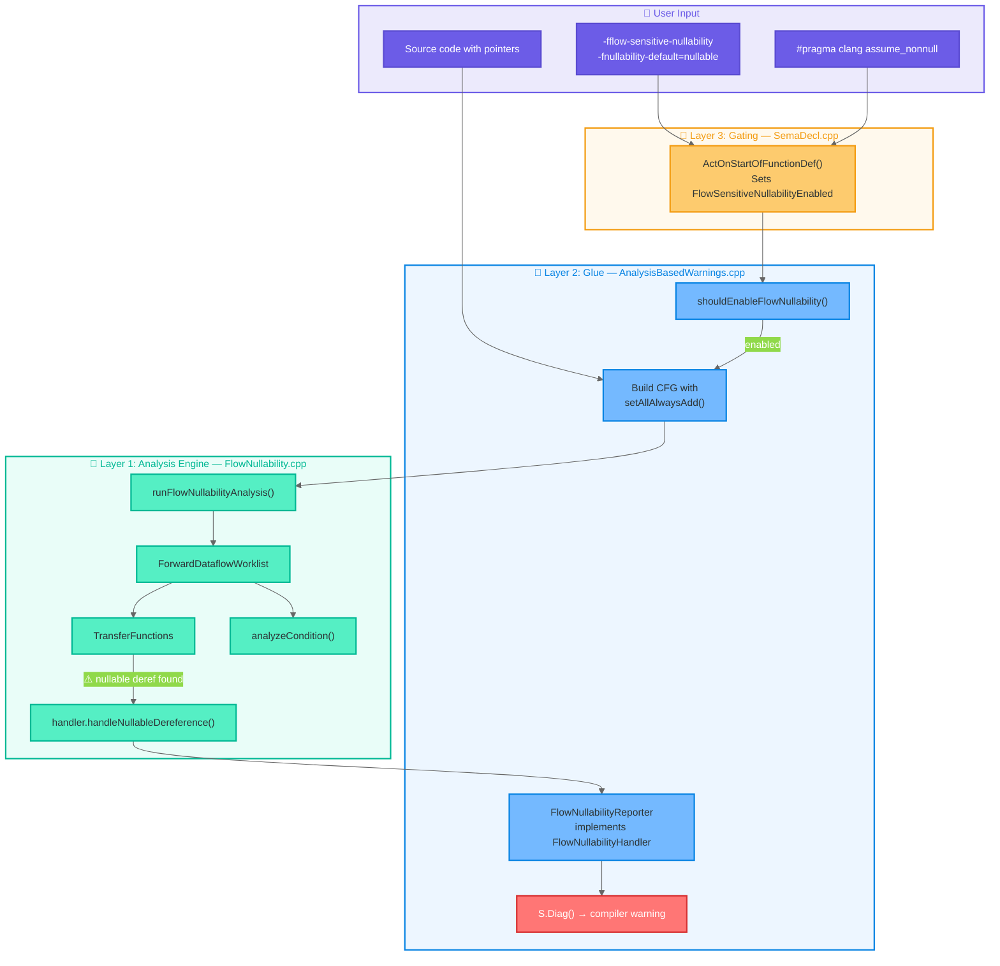
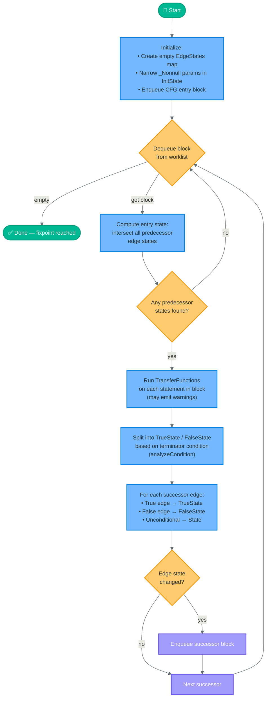
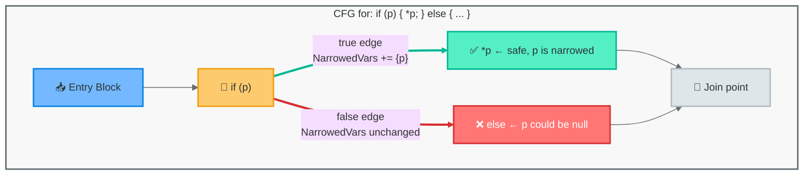
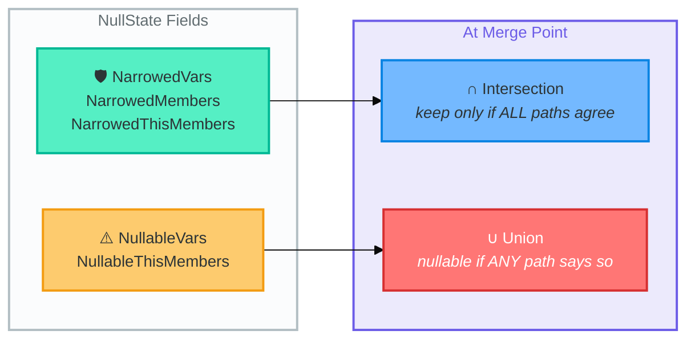
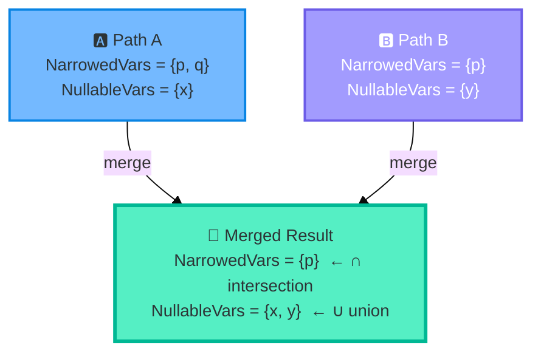
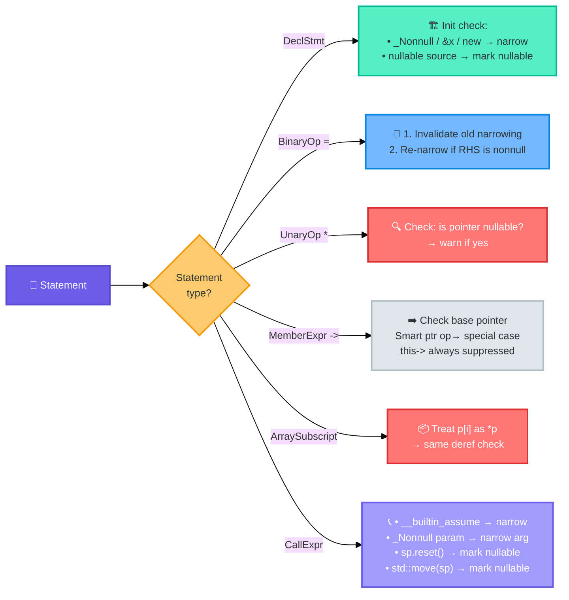
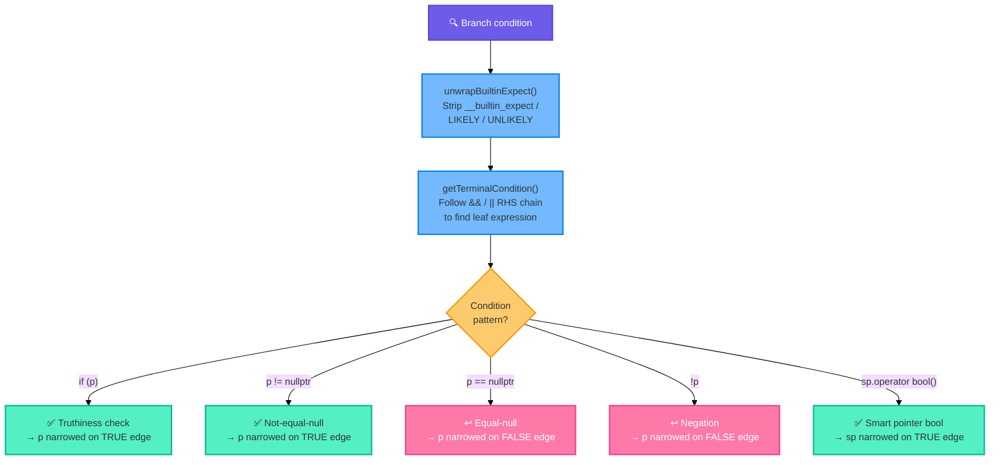
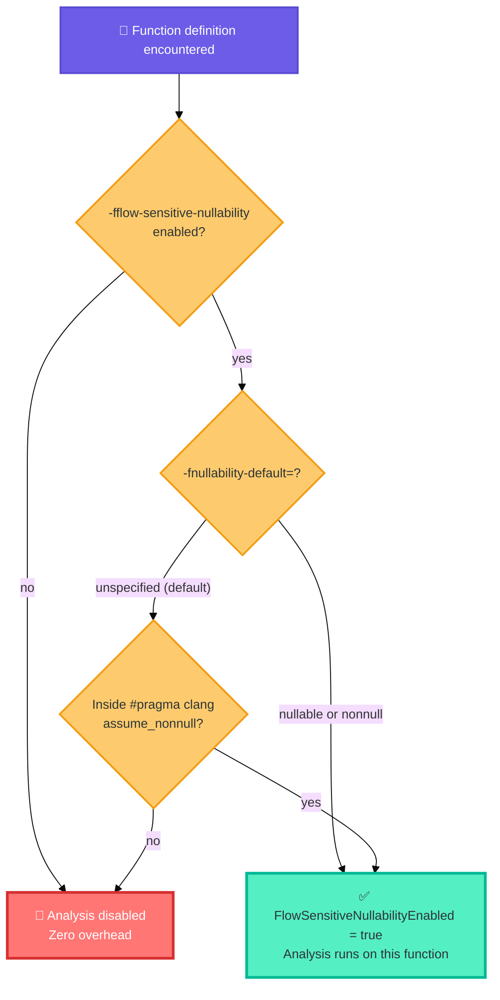
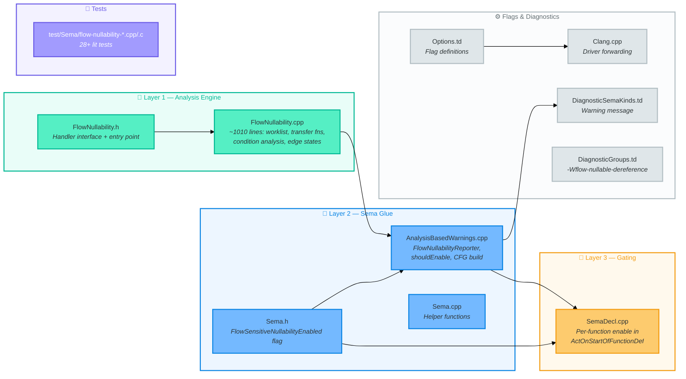

# Flow-Nullability Architecture

Visual guide to the flow-sensitive null pointer dereference checker, integrated into Clang's standard analysis-based warning system.

---

## System Overview

How the three layers connect — from compiler flags down to warning output.

---

## The Worklist Algorithm

The core fixpoint iteration loop (`runFlowNullabilityAnalysis`, lines 880–1009).

---

## Per-Edge State Tracking

Why edges instead of blocks — the key architectural decision.

A per-block analysis would give the `if` block a single state, losing the branch refinement. Per-edge tracking stores `EdgeStates[{pred, succ}]` so each branch carries its own narrowing facts.

---

## NullState Lattice & Merge Semantics

How states combine at control-flow merge points.

---

## Transfer Functions

What happens when each statement type is visited.

---

## Condition Analysis

How `analyzeCondition()` extracts narrowing facts from branch conditions.

---

## Gradual Adoption Decision Tree

How the per-function gating works (`SemaDecl.cpp` + `AnalysisBasedWarnings.cpp`).

---

## File Map

---

## Comparison with Sibling Analyses

This analysis follows the same pattern as two other Clang analyses:

```mermaid
%%{init: {'theme': 'base', 'themeVariables': {'fontSize': '14px'}}}%%
graph TB
    subgraph PATTERN["📐 Common Pattern"]
        A_LIB["lib/Analysis/*.cpp<br>Standalone analysis engine"]
        A_HANDLER["Handler callback interface"]
        A_ABW["AnalysisBasedWarnings.cpp<br>Reporter + wiring"]
    end

    subgraph TS_GRP["🔒 ThreadSafety"]
        TS["ThreadSafety.cpp"]
        TS_H["ThreadSafetyHandler"]
        TS_R["ThreadSafetyReporter"]
    end

    subgraph UV_GRP["❓ UninitializedValues"]
        UV["UninitializedValues.cpp"]
        UV_H["UninitHandler"]
        UV_R["UninitValsDiagReporter"]
    end

    subgraph FN_GRP["🛡️ FlowNullability"]
        FN["FlowNullability.cpp"]
        FN_H["FlowNullabilityHandler"]
        FN_R["FlowNullabilityReporter"]
    end

    A_LIB -.->|"pattern"| TS
    A_LIB -.->|"pattern"| UV
    A_LIB -.->|"pattern"| FN

    A_HANDLER -.-> TS_H
    A_HANDLER -.-> UV_H
    A_HANDLER -.-> FN_H

    A_ABW -.-> TS_R
    A_ABW -.-> UV_R
    A_ABW -.-> FN_R

    classDef pattern fill:#dfe6e9,stroke:#b2bec3,color:#2d3436,stroke-width:2px
    classDef thread fill:#fdcb6e,stroke:#f39c12,color:#2d3436,stroke-width:2px
    classDef uninit fill:#74b9ff,stroke:#0984e3,color:#2d3436,stroke-width:2px
    classDef flow fill:#55efc4,stroke:#00b894,color:#2d3436,stroke-width:2px

    class A_LIB,A_HANDLER,A_ABW pattern
    class TS,TS_H,TS_R thread
    class UV,UV_H,UV_R uninit
    class FN,FN_H,FN_R flow

    style PATTERN fill:#dfe6e920,stroke:#b2bec3,stroke-width:2px,color:#636e72
    style TS_GRP fill:#fdcb6e20,stroke:#f39c12,stroke-width:2px,color:#f39c12
    style UV_GRP fill:#74b9ff20,stroke:#0984e3,stroke-width:2px,color:#0984e3
    style FN_GRP fill:#55efc420,stroke:#00b894,stroke-width:2px,color:#00b894
```

**Key difference**: ThreadSafety and UninitializedValues use **per-block** state. FlowNullability uses **per-edge** state for more precise branch refinement — a technique from the dataflow analysis literature known as "edge-based dataflow" (similar to conditional constant propagation).
